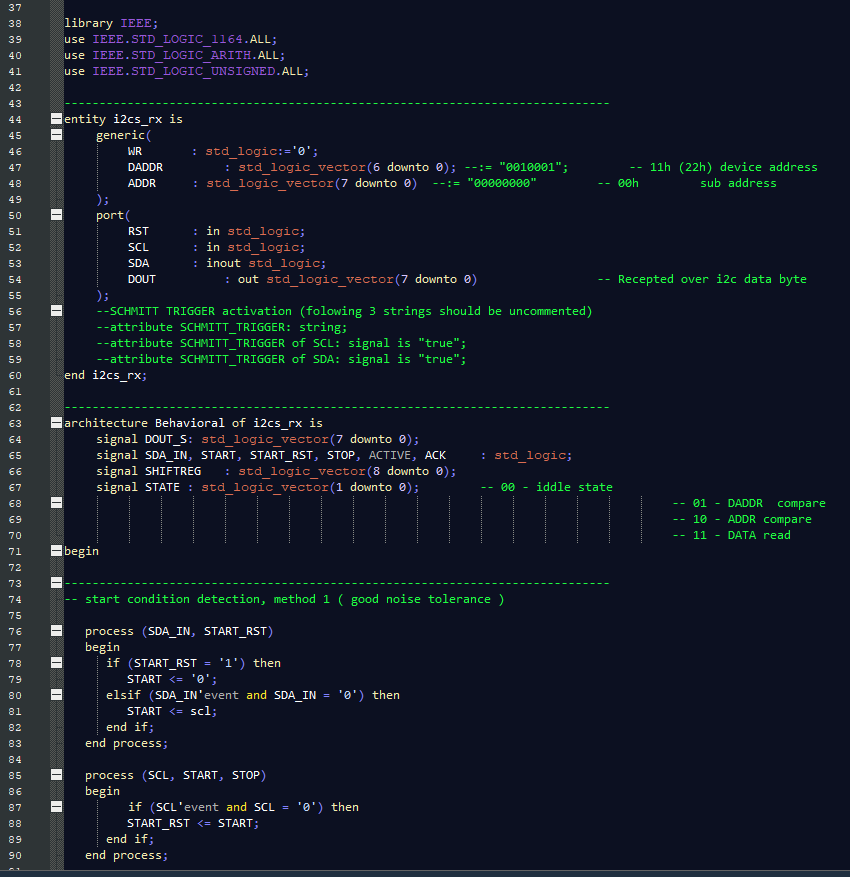

# VHDL THEME FOR NOTEPAD++
this repo contain a vhdl dark theme for notepad++

# Make Changes 
if you want to make changes in theme, edit `.xml` file and copy it and paste it in the `%AppData%\Notepad++\Themes` direcotry where the notepad++ themes is sotred there.

